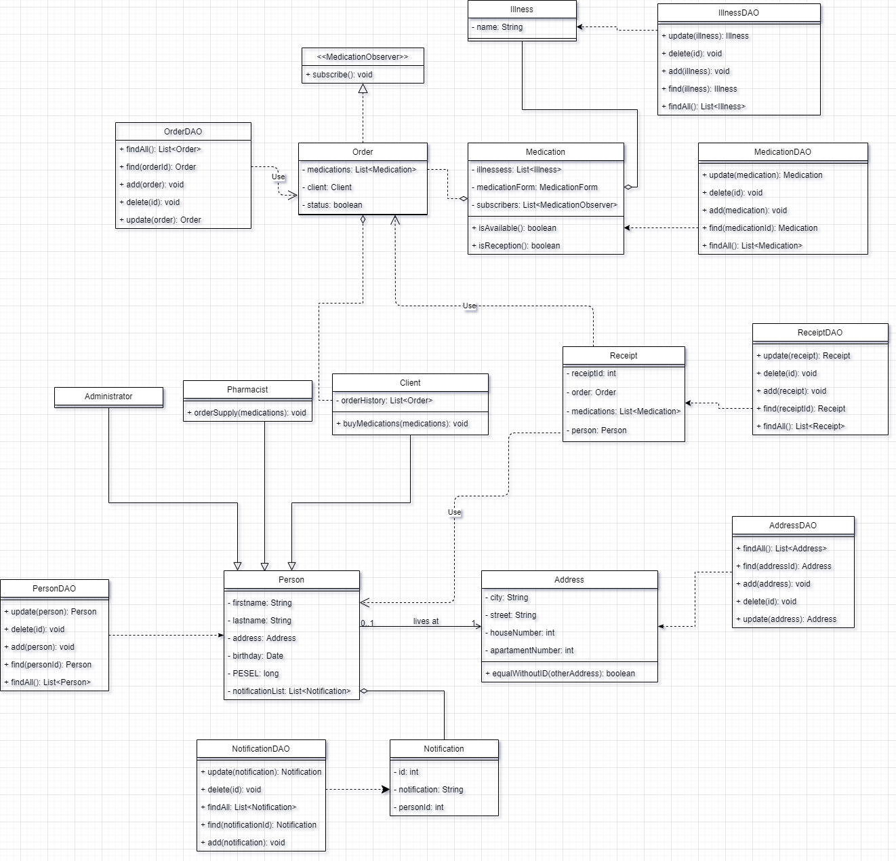

## Dokumentacja na pierwszy milestone spotkanie 08.12

### Uruchomienie projektu

Aby uruchomić projekt wystarczy wykonać komendę:

```
gradle run
``` 

### Model danych

Model danych zakłada, że apteka prowadzi jedynie sprzedaż leków gotowych - nie prowadzi sprzedaży leków recepturowych tworzonych w aptece.

Leki kategoryzowane są ze względu na:

<ul>
    leczone choroby
</ul>
<ul>
    postać leku
</ul>
<ul>
    czy są na receptę
</ul>
<ul>
	cenę
</ul>
<ul>
	czy są obecnie dostępne w danej aptece
</ul>
W poniższym schemacie uml ujęliśmy model obiektowy aplikacji. Wraz z rozwojem aplikacji ilość metod w poszczególnych klasach może przybywać
(np. w klasie Administrator planujemy umieścić metody, które umożliwią użytkownikowi zarządzenie aplikacją).
W schemacie ominęliśmy również funkcje getter/setter dla atrybutów, ponieważ ich ilość pogorszyłaby czytelność schematu.



#### Wzorce projektowe

Postanowiliśmy użyć wzorca obiektowego Data Access Object (DAO).
Naszym plikiem DAO dla Person jest PersonDAO,
dla Medication - MedicationDAO,
dla Address - AddressDAO,
dla Illness - IllnessDAO,
a dla Notification - NotificationDAO.
Na schemacie uml ujęliśmy dodatkowe klasy DAO które zostaną zaimplementowane w późniejszym terminie.
#### Kto co wykonał w tym millestonie

| Wiktor                                             | Przemysław                                                  | Paweł                               | Radosław                                                          |
| :------------------------------------------------- | :---------------------------------------------------------- | :---------------------------------- | :---------------------------------------------------------------- |
| Konfiugracja Hibernate                             | Wyszukanie możliwych miejsc na hosting bazy danych          | Stworzenie początkowych klas modeli | Stworzenie prostego interfejsu terminalowego                      |
| Konfiguracja Gradle i automatycznego uruchamiania  | Stworzenie bazy danych na portalu heroku.com i konfiguracja | Praca nad modelem                   | Stworzenie prymitywnych metod wyszukujących adresy i użytkowników |
| Refactoring kodu                                   | Praca nad modelem                                           |                                     | Praca nad modelem                                                 |
| Praca nad modelem                                  | Dodanie GUI                                             |                                     | Podstawy dokumentacji                                             |

#### Plan na kolejny sprint

<ul>
    Udoskonalenie sposobu wyszukiwania obiektów z bazy danych.
</ul>
<ul>
    Rozbudowa interfejsu UI
</ul>
<ul>
    Implementacja pozostałych elementów modelu danych
</ul>
<ul>
    Dodanie testów do już zaimplementowanego kodu w celu zapewnienia poprawności działania
</ul>

#### Zrzuty z obecnego etapu rozwoju aplikacji

Okienko edycji osoby:


Główne okno aplikacji z widokiem na wszystkie osoby w bazie:


