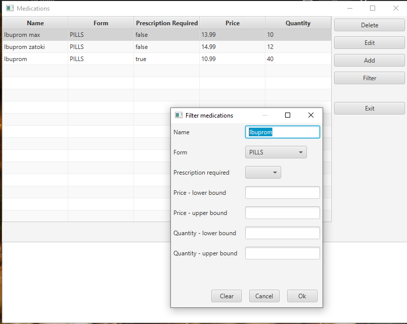
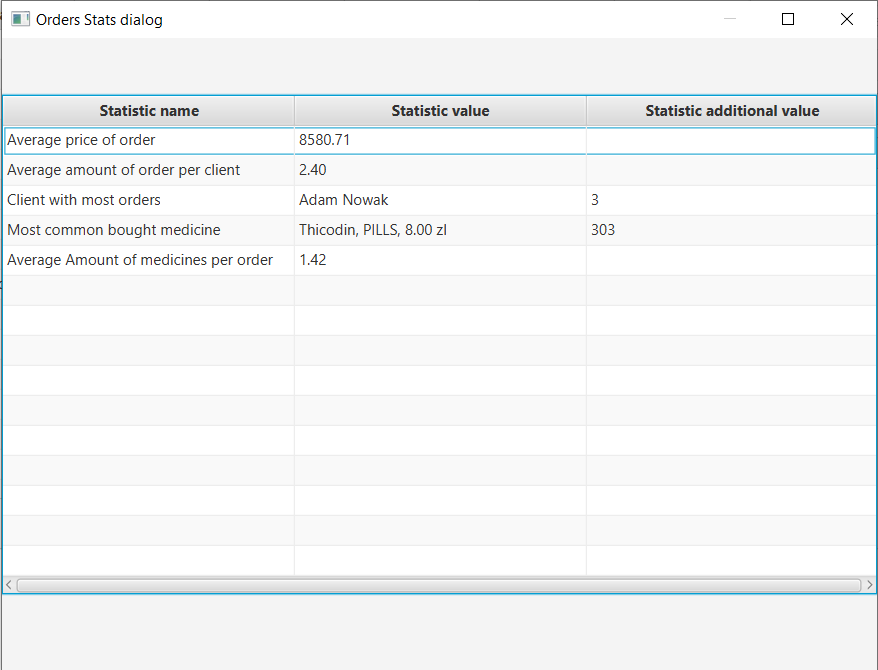
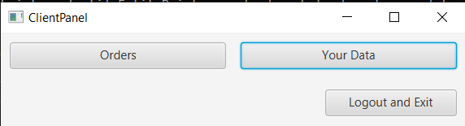
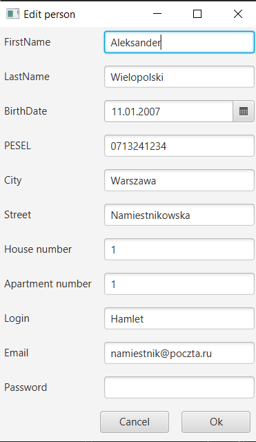
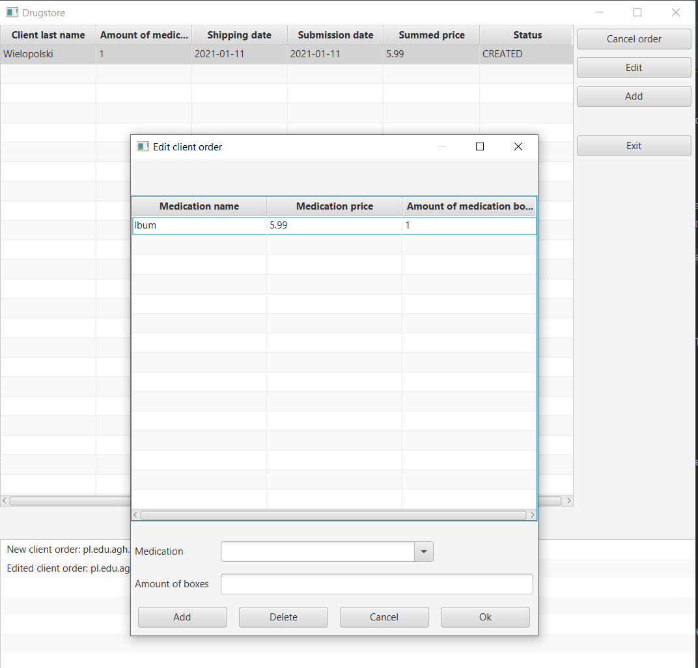
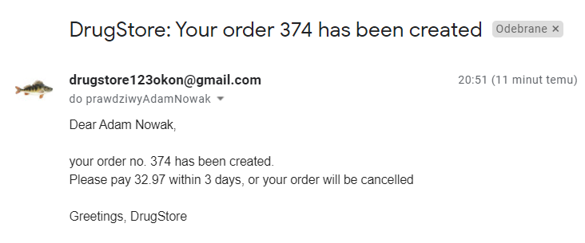
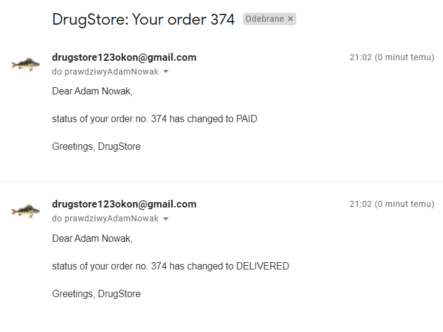
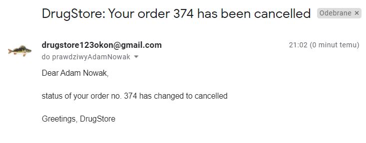

## Dokumentacja na drugi milestone spotkanie 15.12

### Uruchomienie projektu

Aby uruchomić aplikację należy użyć komendy:

```
gradle run
``` 

### Model danych

Główne elementy modelu danych to:

<ul>
    Leki
</ul>
<ul>
    Osoby - klienci i pracownicy
</ul>
<ul>
    Transakcje
</ul>
<ul>
    Powiadomienia
</ul>

Przyjęliśmy założenie, że apteka prowadzi jedynie sprzedaż leków gotowych - nie prowadzi sprzedaży leków recepturowych
tworzonych w aptece.

Leki kategoryzowane są ze względu na:

<ul>
    nazwę
</ul>
<ul>
    postać leku
</ul>
<ul>
    czy są na receptę
</ul>
<ul>
	cenę
</ul>
<ul>
	czy są obecnie dostępne w danej aptece
</ul>

Oprócz tego każdy lek posiada informację na temat tego jakie choroby leczy.

W poniższym schemacie uml ujęliśmy pierwotny model obiektowy aplikacji.
Wraz z rozwojem aplikacji ilość klas i metody w poszczególnych klasach uległy zmianom, ale struktura schematu pozostała 
mniej więcej taka sama.
W schemacie ominęliśmy również funkcje getter/setter dla atrybutów, ponieważ ich ilość pogorszyłaby czytelność schematu.


#### Wzorce projektowe

Do zarządzania bazą danych postanowiliśmy użyć wzorca obiektowego Data Access Object (DAO).
W tym celu utworzyliśmy interfejs ObjectDAO<T> deklarujący potrzebne nam metody, i dla każdej klasy z adnotacją @Entity 
(czyli dla każdej tabeli) utworzyliśmy implementującą ten interfejs klasę DAO.

Do utworzenia GUI zastosowaliśmy wzorzec Model-View-Controller (MVC).

Dodatkowo dodaliśmy wzorzec Command w celu zarządzania operacjami w GUI, takimi jak dodawanie nowych obiektów do bazy.

W celu filtrowania listy leków użyliśmy wzorca Component, który ułatwił zaimplementowanie różnorodnych filtrów.

#### Kto co wykonał w tym millestonie

| Wiktor                                                  | Przemysław                                               | Paweł                                                                  | Radosław                                                          |
| :-------------------------------------------------      | :------------------------------------------------------- | :--------------------------------------------------------------------- | :---------------------------------------------------------------- |
| Poprawa interfejsów, dodanie nowych klas abstrakcyjnych | Dodanie klas GUI wyświetlające użytkowników i lekarstwa  | Stworzenie mechanizmu filtrowania leków na podstawie różnych kryteriów | Stworzenie GUI dla wyświetlania statystyk                                  |
| Dodanie marginesów w aplikacji                          | Dodanie okna logowania i rejestracji użytkowników        | Aktualizacja dokumentacji                                              | Stworzenie części kodu odpowiedzialnej za wyliczanie statystyk   |
| Zmiany w widokach ułatwiające korzystanie z aplikacji   | Dodanie panelu administracyjnego                         |                                                                        | Uzupełnienie dokumentacji o screeny                   |
|                                                         |                                                          |                                                                        |                                                                   | 

#### Opis fragmentów GUI

##### Główne okno aplikacji

Klasa AppController odpowiada za główne okno aplikacji. Początkowo pojawia się okno do wprowadzenia danych. Przykładowy
użytkownik administratora na którego dane można się zalogować.

```
login: admin
hasło: admin
```

##### Okno aplikacji po zalogowaniu

Po zalogowaniu jako admin wyświetla się nam okno z 5 przyciskiami:
<ul>Client orders - panel z zamówieniami klientów</ul>
<ul>Medications - panel z lekami</ul>
<ul>People - panel z osobami w systemie</ul>
<ul>Suppliers - panel z dostawcami</ul>
<ul>Logout and exit - przycisk zakończenia aplikacji</ul>

##### Okno Client Orders

Za to okno odpowiada klasa ClientOrderOverviewController, gdzie klasa ClientOrderAppController odpowiada za jej
odpowiednią inicjalizację. W tym oknie wyświetla się lista zamówień klientów. Mamy możliwość:

<ul>Usunięcie zaznaczonych zamówień</ul>
<ul>Modyfikacji zaznaczonego zamówienia klienta</ul>
<ul>Dodania zamówienia </ul>
<ul>Powrotu do głównego okna aplikacji</ul>
<ul>Zobaczenie statystyk zamówień</ul>

Po naciśnięciu przycisku odpowiadającego za dodanie zamówienia lub modyfikacji wybranego zamówienia wyświetla się nam
nowe okno. Za to okno odpowiada klasa ClientOrderEditDialogPresenter. W tym oknie możemy:

<ul>Wybrać klienta który dokonuje zamówienie</ul>
<ul>Wybrać datę wysłania zamówienia</ul>
<ul>Wybrać datę złożenia zamówienia</ul>
<ul>
Wybrania listy leków w tym zamówieniu, włącznie z ilością opakowań danego lekarstwa. 
Lek któy chcemy dodać możemy wybrać z listy, lub przefiltrować listę leków wpisując początek nazwy leku. 
Aby dodać dany lek klikamy przycisk add, aby usunąć element wybrany element klikamy przycisk Delete.
Aby zatwierdzić zmiany klikamy Ok, aby wycofać klikamy Cancel.
</ul>
<ul>Zmień status zamówienia</ul>

##### Okno Medications

Za to okno odpowiada klasa MedicationOverviewController, gdzie klasa MedicationAppController odpowiada za jej
odpowiednią inicjalizację. W tym oknie wyświetla się lista leków w bazie apteki. Mamy możliwość:

<ul>Usunięcie zaznaczonych leków</ul>
<ul>Modyfikacji zaznaczonego leku</ul>
<ul>Dodania leku</ul>
<ul>Przefiltrować dane w tabeli</ul>
<ul>Powrotu do głównego okna aplikacji</ul>

Po naciśnięciu przycisku odpowiadającego za dodanie leku lub modyfikacji wybranego leku wyświetla się nam nowe okno. Za
to okno odpowiada klasa MedicationEditDialogPresenter. W tym oknie możemy:

<ul>Wybrać nazwę leku</ul>
<ul>Wybrać postać leku</ul>
<ul>Podać czy lek wymaga recepty</ul>
<ul>Wybrać cenę danego leku</ul>
<ul>Wybrać liczbę paczek leku w magazynie</ul>

Po naciśnięciu przycisku odpowiadającego za filtrowanie leków wyświetla się nowe okno, za które odpowiada klasa 
MedicationsFilterDialogPresenter. W tym oknie ustawiamy filtry:

<ul>Wyrażenie, które musi zawierać nazwa leku</ul>
<ul>Formę leku</ul>
<ul>Czy jest potrzebna recepta</ul>
<ul>Dolne ograniczenie na cenę</ul>
<ul>Górne ograniczenie na cenę</ul>
<ul>Dolne ograniczenie na ilość sztuk leku w aptece</ul>
<ul>Górne ograniczenie na ilość sztuk leku w aptece</ul>

##### Okno People

Za to okno odpowiada klasa PersonOverviewController, gdzie klasa PersonAppController odpowiada za jej odpowiednią
inicjalizację. W tym oknie wyświetla się lista osób w bazie apteki. Mamy możliwość:

<ul>Usunięcie zaznaczonych osób</ul>
<ul>Modyfikacji danych zaznaczonej osoby</ul>
<ul>Dodania osoby</ul>
<ul>Powrotu do głównego okna aplikacji</ul>

Po naciśnięciu przycisku odpowiadającego za dodanie osoby lub modyfikacji danych wybranej osoby wyświetla się nam nowe
okno. Za to okno odpowiada klasa PersonEditDialogPresenter. W tym oknie możemy:

<ul>Wybrać imię osoby</ul>
<ul>Wybrać nazwisko osoby</ul>
<ul>Wybrać datę urodzenia osoby</ul>
<ul>Wybrać PESEL osoby</ul>
<ul>Wybrać rolę osoby w systemie</ul>
<ul>Wybrać adres osoby składający się z: miasta, ulicy, numeru budynku, 
numeru mieszkania</ul>
<ul>Wybrać login osoby w systemie</ul>
<ul>Wybrać hasło osoby w systemie</ul>

##### Okno Suppliers

Za to okno odpowiada klasa SupplierOverviewController, gdzie klasa SupplierAppController odpowiada za jej odpowiednią
inicjalizację. W tym oknie wyświetla się lista leków w bazie apteki. Mamy możliwość:

<ul>Usunięcie zaznaczonych dostawców</ul>
<ul>Modyfikacji danych zaznaczonego dostawcy</ul>
<ul>Dodania dostawcy</ul>
<ul>Powrotu do głównego okna aplikacji</ul>

Po naciśnięciu przycisku odpowiadającego za dodanie dostawcy lub modyfikacji wybranego dostawcy wyświetla się nam nowe
okno. Za to okno odpowiada klasa SupplierEditDialogPresenter. W tym oknie możemy:

<ul>Wybrać nazwę dostawcy</ul>
<ul>Wybrać number NIP dostawcy</ul>

#### Zrzuty z obecnego etapu rozwoju aplikacji

Okienko logowania:


Okienko rejestracji użytkownika:


Okno panelu admina:


Okno dostawców:


Okno panelu lekarstw:


Okno panelu lekarstw filtrowanie:



Okno panelu uzytkowników:


Okno zamówień klientów:


Okno statystyk zamówień:



Okno panelu klienta:



Okno panelu klienta edycja danych:



Okno panelu klienta zamowienia:



Emaile z powiadomieniami:






